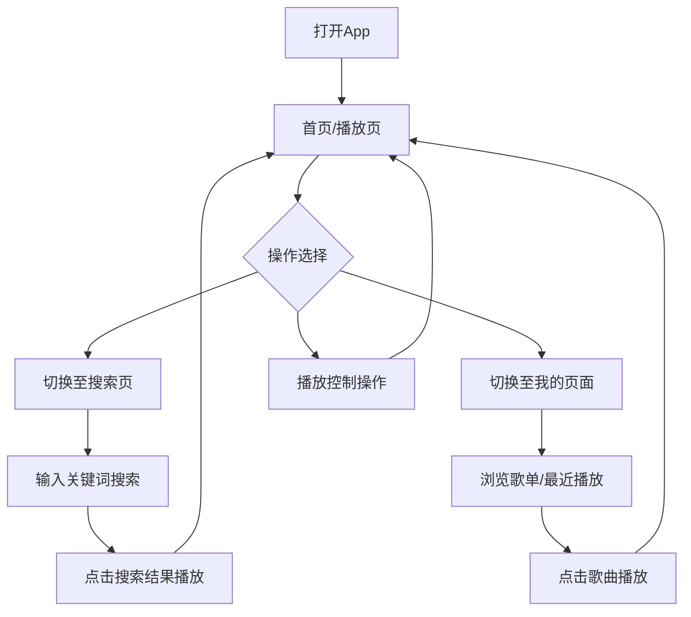

## 1. 产品概述

一款极简高质感音乐播放器 Web App，聚焦于沉浸式听歌体验。采用深色玻璃拟态设计风格，提供搜索、播放、个人中心三大核心功能。

- 目标用户：喜欢听歌、追求视觉美感的年轻用户
- 核心价值：极简美观的音乐播放体验，融合玻璃拟态与液态动效的视觉风格

## 2. 核心功能

### 2.1 功能模块

1. **首页/播放页**：当前播放歌曲展示、播放控制（播放/暂停、上一首、下一首、进度条）、歌曲封面旋转动画
2. **搜索页**：搜索歌曲、搜索历史、搜索结果列表
3. **我的页面**：我的歌单、最近播放、收藏歌曲

### 2.2 页面详情

| 页面名称 | 模块名称 | 功能描述 |
|---------|---------|---------|
| 首页（播放页） | 歌曲封面区 | 专辑封面大图展示，带动画旋转效果 |
| 首页（播放页） | 歌曲信息区 | 显示歌曲名、歌手名 |
| 首页（播放页） | 播放控制区 | 播放/暂停、上一首、下一首按钮 |
| 首页（播放页） | 进度条 | 显示播放进度，可拖拽控制 |
| 搜索页 | 搜索框 | 输入关键词搜索歌曲 |
| 搜索页 | 搜索历史 | 显示最近搜索的关键词 |
| 搜索页 | 搜索结果 | 展示搜索到的歌曲列表 |
| 我的页面 | 用户信息 | 显示用户头像、昵称 |
| 我的页面 | 我的歌单 | 展示用户创建的歌单列表 |
| 我的页面 | 最近播放 | 展示最近播放的歌曲记录 |

## 3. 核心流程

用户打开 App 默认进入首页（播放页），可切换至搜索页搜索歌曲，或进入我的页面管理歌单。底部悬浮菜单栏始终可见，支持三页面间快速切换。

## 4. 用户界面设计

### 4.1 设计风格

- **主色调**：纯黑背景 (#000000)，白色文字 (#FFFFFF)
- **辅色调**：半透明白色用于玻璃效果 (rgba(255,255,255,0.05-0.15))
- **强调色**：白色高光 (rgba(255,255,255,0.2))
- **按钮风格**：高圆角 (border-radius: 16px-24px)，玻璃拟态效果
- **字体**：系统无衬线字体，字体粗细 300-600
- **布局风格**：全屏深色背景，内容居中，底部悬浮菜单
- **图标**：阿里巴巴图标库 (IconFont)，不使用 emoji
- **动效**：封面旋转动画、玻璃模糊过渡、页面切换淡入淡出

### 4.2 页面设计概览

| 页面名称 | 模块名称 | UI 元素 |
|---------|---------|--------|
| 首页（播放页） | 封面区 | 圆形专辑封面 280x280px，旋转动画，居中布局 |
| 首页（播放页） | 歌曲信息 | 歌名（大字 24px）、歌手名（小字 16px），底部间距 |
| 首页（播放页） | 进度条 | 自定义滑块，渐变白色轨道，圆角滑块 |
| 首页（播放页） | 控制按钮 | 三个圆形按钮（上一首、播放/暂停、下一首），大尺寸 56px |
| 搜索页 | 搜索框 | 圆角输入框 16px，带搜索图标，背景半透明玻璃 |
| 搜索页 | 搜索历史 | 标签式历史关键词，可点击可删除 |
| 搜索页 | 搜索结果 | 列表样式，每项含小封面图、歌名、歌手 |
| 我的页面 | 用户头像 | 大圆形头像 80px，居中 |
| 我的页面 | 列表项 | 歌单/最近播放列表，图标+文字，玻璃卡片容器 |
| 底部菜单 | 导航栏 | 三个导航项（搜索/首页/我的），高圆角 24px，悬浮效果 |

### 4.3 响应式

- 移动端优先设计，固定宽度 375px-430px 适配
- 内容区域上下留白，安全区域适配
- 触控优化：按钮点击区域不小于 44px

### 4.4 玻璃拟态效果规范

- 背景模糊：backdrop-filter: blur(20px) 至 blur(40px)
- 背景透明度：rgba(255, 255, 255, 0.05) 至 rgba(255, 255, 255, 0.12)
- 边框：半透明白色边框 0.5px-1px，rgba(255,255,255,0.08)
- 圆角：16px-24px 大圆角
- 阴影：柔和的白色投影