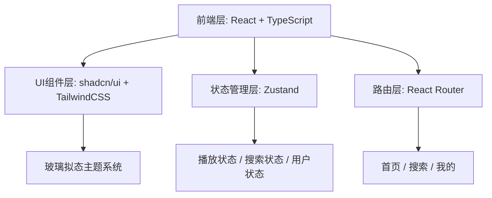

## 1. 架构设计



## 2. 技术说明

- **前端**：React@18 + TypeScript + TailwindCSS@3 + Vite
- **初始化工具**：vite-init react-ts 模板
- **UI 组件库**：shadcn/ui（按钮、滑块、卡片等）
- **状态管理**：Zustand（管理播放状态、搜索历史、歌单数据）
- **路由**：React Router v6
- **图标**：阿里巴巴图标库 (IconFont) - 使用在线链接方式引入
- **后端**：无，使用 Mock 数据演示

## 3. 路由定义

| 路由 | 页面 | 说明 |
|------|------|------|
| / | 首页/播放页 | 默认页面，音乐播放器主界面 |
| /search | 搜索页 | 歌曲搜索功能 |
| /profile | 我的页面 | 用户歌单和播放记录 |

## 4. 数据结构

### 4.1 歌曲数据模型

```typescript
interface Song {
  id: string
  title: string
  artist: string
  cover: string
  duration: number // 秒
  album: string
}
```

### 4.2 播放状态

```typescript
interface PlayerState {
  currentSong: Song | null
  isPlaying: boolean
  progress: number // 0-100
  volume: number // 0-1
  playlist: Song[]
}
```

### 4.3 搜索状态

```typescript
interface SearchState {
  query: string
  history: string[]
  results: Song[]
}
```

### 4.4 用户状态

```typescript
interface UserState {
  favorites: Song[]
  recentPlays: Song[]
  playlists: { id: string; name: string; songs: Song[] }[]
}
```

## 5. 组件架构

```
src/
├── components/
│   ├── ui/            # shadcn/ui 基础组件
│   ├── BottomNav.tsx   # 底部悬浮导航栏
│   ├── PlayerBar.tsx   # 播放控制栏
│   ├── SongCard.tsx    # 歌曲卡片
│   └── GlassCard.tsx   # 玻璃拟态卡片容器
├── pages/
│   ├── HomePage.tsx    # 首页/播放页
│   ├── SearchPage.tsx  # 搜索页
│   └── ProfilePage.tsx # 我的页面
├── hooks/
│   └── usePlayer.ts    # 播放控制 Hook
├── store/
│   ├── playerStore.ts  # 播放状态
│   ├── searchStore.ts  # 搜索状态
│   └── userStore.ts    # 用户状态
├── data/
│   └── mock.ts         # Mock 数据
├── lib/
│   └── utils.ts        # 工具函数
├── App.tsx
└── main.tsx
```

## 6. Mock 数据

使用本地 Mock 数据模拟歌曲列表，包含 6-8 首不同风格的示例歌曲，包含封面图（使用 picsum.photos 占位图）、歌名、歌手名、时长等信息。